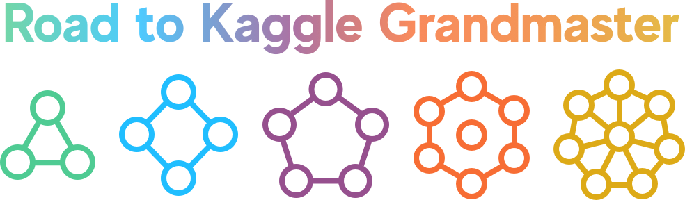

### Bonjour, I am John 😁

  

## Info

</a> 

&nbsp;&nbsp;&nbsp;
&nbsp;&nbsp;&nbsp;
# 
# 
# 

 
 <b>VISITOR COUNT:</b> 
  

### 📈 GitHub Stats

   •   
  

### Connect With Me 

## Contact Me 💬

  
  
  
  </a>
  
   
  
  
  

 

## Languages & Tools 🛠️

  
  
  
  
  
   
  
  
  
  
  

  
  
  
  
   
  
  
  

  
  
  
  
  

  
  <!--  -->
  

 

<b>Frameworks I'm familiar with:</b>

